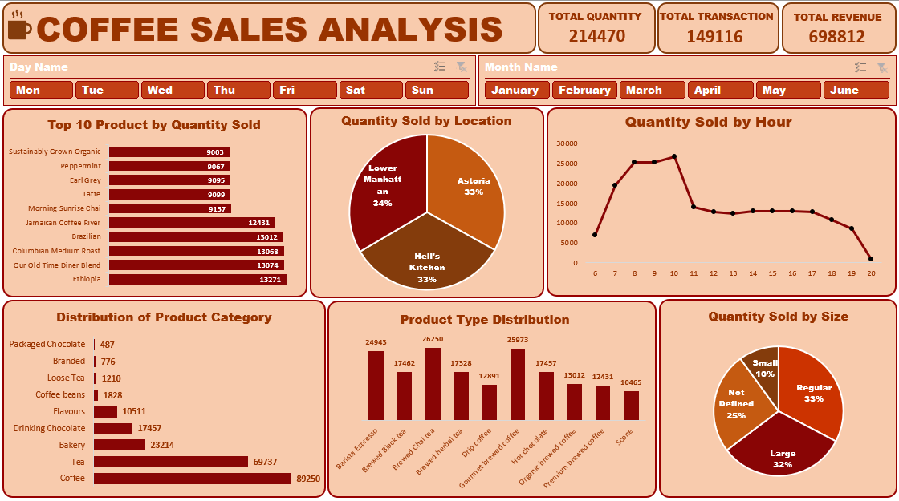

# ☕ Coffee Sales Analysis Dashboard (Excel Project)

## 📊 Project Overview
This project analyzes coffee sales data to uncover insights on product performance, customer preferences, and sales patterns.  
Built entirely in **Microsoft Excel**, it showcases data cleaning, visualization, and analytical storytelling.

## 🧠 Key Insights
- **Total Quantity Sold:** 214,470  
- **Total Transactions:** 149,116  
- **Total Revenue:** 698,812  
- **Top Selling Products:** Ethiopia, Our Old Time Diner Blend, Columbian Medium Roast  
- **Peak Sales Hours:** Between 8 AM and 10 AM  
- **Most Popular Categories:** Coffee and Tea  

## 🧰 Tools Used
- Microsoft Excel (Pivot Tables, Charts, Slicers)
- Power Query (for data cleaning)
- Dashboard Design Principles

## 📸 Dashboard Preview

## 🚀 How to Use
1. Download the Excel file.
2. Open it in Excel (Desktop version recommended).
3. Use slicers to explore sales by day, month.
